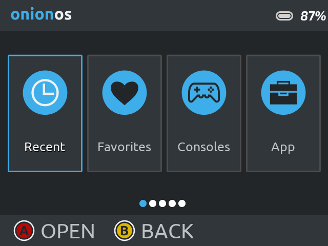
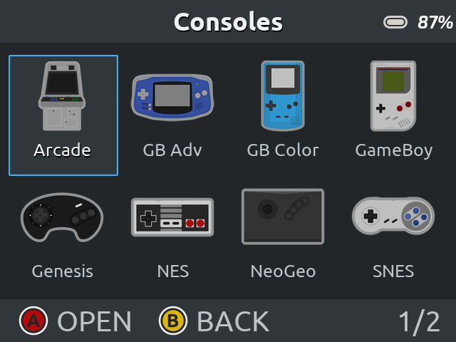
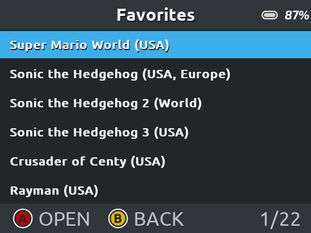
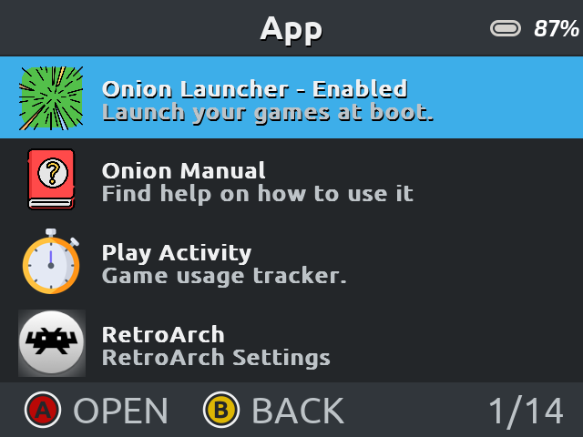

# Breeze Dark theme for OnionOS

Theme for the [OnionOS](https://github.com/jimgraygit/Onion) customization layer made for Miyoo Mini devices.

I took [Lilla by evolve](https://github.com/jimgraygit/Onion/files/8598951/Lilla.zip) theme as a base and then I've loosely followed [Breeze Dark](https://develop.kde.org/hig/style/color/dark/) (KDE Plasma theme) colorscheme and icons. [Ubuntu font](https://design.ubuntu.com/font/) the default font.

> **Important:** This is still a work in progess and I haven't replaced all purplish colors with the breeze blue.

# [Click here to download](https://github.com/pbl0/BreezeDarkOnion/releases)

### Screenshots:

